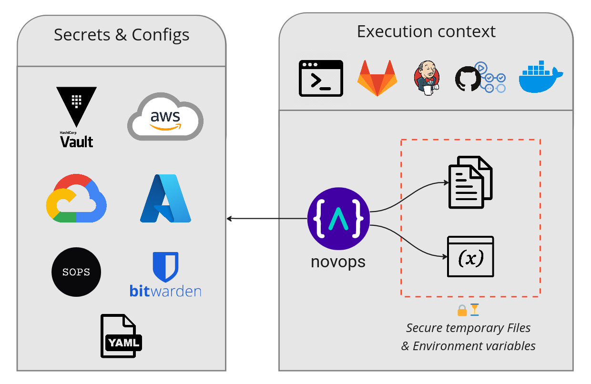

# Novops



Novops is like `.env`, but on steroïd 💪 

- Load secrets directly in memory from any source (AWS, GCloud, Azure...)
- Manage multiple environments
- Set plain variables, secrets, files and generate temporary credentials
- Stop spreading secrets across CI tools and dev environments

Use Novops to easily setup secrets and variables in your development environment or CI platform. Stop having developers setup their own `.env.prod`, `.bashrc` - Novops takes care of it and make sure everyone's on the same page. 


---

- [Getting Started](#getting-started)
- [🔐 Security](#-security)
- [Features](#features)
- [Example usage](#example-usage)
  - [Shell](#shell)
  - [🐳 Docker \& Podman](#-docker--podman)
  - [Multi-environment context](#multi-environment-context)
  - [Temporary files](#temporary-files)
  - [Plain strings](#plain-strings)
  - [More examples: Nix, GitLab, GitHub, Ansible, Terraform, Pulumi...](#more-examples-nix-gitlab-github-ansible-terraform-pulumi)
- [Modules: load secrets and generate temporary credentials](#modules-load-secrets-and-generate-temporary-credentials)
  - [Hashicorp Vault](#hashicorp-vault)
  - [AWS](#aws)
  - [All modules: AWS, Hashicorp Vault, GCloud, Azure...](#all-modules-aws-hashicorp-vault-gcloud-azure)
- [Full Documentation](#full-documentation)
- [Community and Support](#community-and-support)
- [Roadmap](#roadmap)
- [Contributing](#contributing)
- [Inspiration and similar tools](#inspiration-and-similar-tools)
- [License](#license)
- [Acknowledgment](#acknowledgment)

## Getting Started

Let's deploy an application with **secret password and SSH key from Hashicorp Vault** and **temporary AWS credentials**.

Install static binary (or [use Nix](https://pierrebeucher.github.io/novops/install.html#nix)):

```sh
curl -L "https://github.com/PierreBeucher/novops/releases/latest/download/novops-X64-Linux.zip" -o novops.zip
unzip novops.zip
sudo mv novops /usr/local/bin/novops
```

Create `.novops.yml` and commit it safely - it does not contain any secret:

```yaml
environments:
  dev:
    
    # Environment variables for dev environment
    variables:
      
      # Fetch Hashicorp Vault secrets
      - name: DATABASE_PASSWORD
        value:
          hvault_kv2:
            path: app/dev
            key: db_password

      # Plain string are also supported
      - name: DATABASE_USER
        value: root
    
    # Load files in memory (not written on disk)
    files:
      - variable: APP_SSH_KEY # Will point to generated file
        content:
          hvault_kv2:
            path: app/dev
            key: ssh_key
    
    # Generate temporary AWS credentials for IAM Role
    # Provide environment variables:
    # - AWS_ACCESS_KEY_ID
    # - AWS_SECRET_ACCESS_KEY
    # - AWS_SESSION_TOKEN
    aws:
      assume_role:
        role_arn: arn:aws:iam::12345678910:role/dev_deploy
```

Load secrets as environment variables:

```sh
# Run a sub-process with secrets
# Secrets are cleaned-up on exit
novops run -- sh

# Or source directly into your shell
source <(novops load)
```

Secrets are now available:

```sh
echo $DATABASE_PASSWORD
# passxxxxxxx

echo $APP_SSH_KEY
# /run/user/1000/novops/... 
# Files are not written on disk but remain in memory

env | grep AWS
# AWS_ACCESS_KEY_ID=AKIAXXX
# AWS_SECRET_ACCESS_KEY=xxx
# AWS_SESSION_TOKEN=xxx
```

## 🔐 Security

Novops loads secrets in memory and does not write anything to disk. Secrets are loaded temporarily and kept only for as long as they are needed.

See [Novops Security Model](https://pierrebeucher.github.io/novops/security.html) for details

## Features

- Securely load secrets and generate temporary credentials directly in memory as environment variables or temporary files
- Fetch secrets at their source. No more syncing secrets between local tool, CI/CD, and Cloud secret service
- Fetch secrets from anywhere: Hashicorp Vault, AWS, Google Cloud, Azure...
- Provide secrets directly to process, easing usage of IaC tools like Terraform, Pulumi, Ansible...
- Manage multi-environments setup
- Easy installation with fully static binary or Nix 

## Example usage

### Shell

Novops run in any shell

```sh
# Run a sub-process with secrets
# Secrets are cleaned-up on exit
novops run -- sh

# Or source directly into current shell
source <(novops load)
```

### 🐳 Docker & Podman

Load environment variables directly into containers:

```sh
docker run -it --env-file <(novops load -f dotenv -e dev) alpine sh
```

```
podman run -it --env-file <(novops load -f dotenv -e dev) alpine sh
```

### Multi-environment context

`.novops.yml` support multi-environment context:

```yaml
environments:
  dev:
    variables:      
      - name: DATABASE_PASSWORD
        value:
          hvault_kv2:
            path: app/dev
            key: db_password
  prod:
    variables:      
      - name: DATABASE_PASSWORD
        value:
          hvault_kv2:
            path: app/prod
            key: db_password
```

`novops` prompts for environment by default

```sh
novops load 
# Select environment: dev, prod
```

Use `-e ENV` to avoid prompt and run directly

```sh
novops load -e dev
```

Or specify a default environment in `.novops.yml`

```yaml
config:
  default:
    environment: dev
```

### Temporary files 

Novops can write secret in files such as SSH keys. Files are not written to disk but in memory under a secure directory, see [Novops Security Model](https://pierrebeucher.github.io/novops/security.html).

```yaml
environments:
  dev:   
    files:
      
      # Each file entry generates a file AND an environment variable
      # pointing to generated file such as
      # ANSIBLE_PRIVATE_KEY=/run/user/1000/novops/.../file_ANSIBLE_PRIVATE_KEY
      - variable: ANSIBLE_PRIVATE_KEY
        content:
          hvault_kv2:
            path: app/dev
            key: ssh_key

```

### Plain strings

Like `.env`, Novops support plain strings. This can be useful to specify both user and passwords or some generic configs.

```yaml
environments:
  dev:
    variables:      
      # Plain string will be loaded as DATABASE_USER="app-dev"
      - name: DATABASE_USER
        value: app-dev

      - name: DATABASE_PASSWORD
        value:
          hvault_kv2:
            path: crafteo/app/dev
            key: db_password
    files:
      # File with plain string content
      - variable: APP_CONFIG
        content: |
            db_host: localhost
            db_port: 3306

```

### More examples: Nix, GitLab, GitHub, Ansible, Terraform, Pulumi...

- [Shell](https://pierrebeucher.github.io/novops/examples/shell.html)
- [Docker & Podman](https://pierrebeucher.github.io/novops/examples/docker.html)
- [Nix](https://pierrebeucher.github.io/novops/examples/nix.html)
- CI / CD
  - [GitLab CI](https://pierrebeucher.github.io/novops/examples/cicd/gitlab-ci.html)
  - [GitHub Action](https://pierrebeucher.github.io/novops/examples/cicd/github-action.html)
  - [Jenkins](https://pierrebeucher.github.io/novops/examples/cicd/jenkins.html)
- Infra as Code
  - [Ansible](https://pierrebeucher.github.io/novops/examples/iac/ansible.html)
  - [Terraform](https://pierrebeucher.github.io/novops/examples/iac/terraform.html)
  - [Pulumi](https://pierrebeucher.github.io/novops/examples/iac/pulumi.html)


## Modules: load secrets and generate temporary credentials

Novops uses _modules_ to load and generate temporary secrets from various platforms and providers. Configure them in `.novops.yml`:

### Hashicorp Vault

Supported Hashicorp Vault Secret Engines:

- Key Value v1/v2
- AWS: generate temporary STS credentials

```yaml
environments:
  dev:
    variables:
      
      # Key Value v2
      - name: DATABASE_PASSWORD
        value:
          hvault_kv2:
            path: app/dev
            key: db_password
      
      # Key Value v1
      - name: SECRET_TOKEN
        value:
          hvault_kv1:
            path: app/dev
            key: token
            mount: kv1

    # Hashivault module with AWS secret engine
    hashivault:
      aws:
        name: dev_role
        role_arn: arn:aws:iam::111122223333:role/dev_role
        role_session_name: dev-session
        ttl: 2h
```

### AWS

Multiple AWS services are supported:

- Secrets Manager
- STS Assume Role for temporary IAM Role credentials
- SSM Parameter Store

```yaml
environments:
  dev:

    variables:
      # SSM Parameter Store
      - name: SOME_PARAMETER_STORE_SECRET
        value:
          aws_ssm_parameter:
            name: secret-parameter
      
      # Secrets Manager
      - name: SOME_SECRET_MANAGER_PASSWORD
        value:
          aws_secret:
            id: secret-password
    
    # Generate temporary AWS credentials for IAM Role
    # Generate environment variables:
    # - AWS_ACCESS_KEY_ID
    # - AWS_SECRET_ACCESS_KEY
    # - AWS_SESSION_TOKEN
    aws:
      assume_role:
        role_arn: arn:aws:iam::12345678910:role/dev_deploy
```

### All modules: AWS, Hashicorp Vault, GCloud, Azure...


- <svg xmlns="http://www.w3.org/2000/svg" width="15" height="15" viewBox="0 0 24 24"><rect x="0" y="0" width="24" height="24" fill="none" stroke="none" /><path fill="currentColor" d="m0 0l11.955 24L24 0zm13.366 4.827h1.393v1.38h-1.393zm-2.77 5.569H9.22V8.993h1.389zm0-2.087H9.22V6.906h1.389zm0-2.086H9.22V4.819h1.389zm2.087 6.263h-1.377V11.08h1.388zm0-2.09h-1.377V8.993h1.388zm0-2.087h-1.377V6.906h1.388zm0-2.086h-1.377V4.819h1.388zm.683.683h1.393v1.389h-1.393zm0 3.475V8.993h1.389v1.388Z"/></svg> [Hashicorp Vault](https://pierrebeucher.github.io/novops/config/hashicorp-vault.html)
  - Key Value v1/v2
  - AWS temporary credentials
- <svg xmlns="http://www.w3.org/2000/svg" width="15" height="15" viewBox="0 0 256 153"><rect x="0" y="0" width="256" height="153" fill="none" stroke="none" /><path fill="#252F3E" d="M72.392 55.438c0 3.137.34 5.68.933 7.545a45.373 45.373 0 0 0 2.712 6.103c.424.678.593 1.356.593 1.95c0 .847-.508 1.695-1.61 2.543l-5.34 3.56c-.763.509-1.526.763-2.205.763c-.847 0-1.695-.424-2.543-1.187a26.224 26.224 0 0 1-3.051-3.984c-.848-1.44-1.696-3.052-2.628-5.001c-6.612 7.798-14.92 11.698-24.922 11.698c-7.12 0-12.8-2.035-16.954-6.103c-4.153-4.07-6.272-9.495-6.272-16.276c0-7.205 2.543-13.054 7.714-17.462c5.17-4.408 12.037-6.612 20.768-6.612c2.882 0 5.849.254 8.985.678c3.137.424 6.358 1.102 9.749 1.865V29.33c0-6.443-1.357-10.935-3.985-13.563c-2.712-2.628-7.29-3.9-13.817-3.9c-2.967 0-6.018.34-9.155 1.103c-3.136.762-6.188 1.695-9.155 2.882c-1.356.593-2.373.932-2.967 1.102c-.593.17-1.017.254-1.356.254c-1.187 0-1.78-.848-1.78-2.628v-4.154c0-1.356.17-2.373.593-2.966c.424-.594 1.187-1.187 2.374-1.78c2.967-1.526 6.527-2.798 10.68-3.815C33.908.763 38.316.255 42.978.255c10.088 0 17.463 2.288 22.21 6.866c4.662 4.577 7.036 11.528 7.036 20.853v27.464h.17ZM37.976 68.323c2.798 0 5.68-.508 8.731-1.526c3.052-1.017 5.765-2.882 8.053-5.425c1.357-1.61 2.374-3.39 2.882-5.425c.509-2.034.848-4.493.848-7.375v-3.56a70.791 70.791 0 0 0-7.799-1.441a63.874 63.874 0 0 0-7.968-.509c-5.68 0-9.833 1.102-12.63 3.391c-2.798 2.289-4.154 5.51-4.154 9.748c0 3.984 1.017 6.951 3.136 8.986c2.035 2.119 5.002 3.136 8.901 3.136Zm68.069 9.155c-1.526 0-2.543-.254-3.221-.848c-.678-.508-1.272-1.695-1.78-3.305L81.124 7.799c-.51-1.696-.764-2.798-.764-3.391c0-1.356.678-2.12 2.035-2.12h8.307c1.61 0 2.713.255 3.306.848c.678.509 1.187 1.696 1.695 3.306l14.241 56.117l13.224-56.117c.424-1.695.933-2.797 1.61-3.306c.679-.508 1.866-.847 3.392-.847h6.781c1.61 0 2.713.254 3.39.847c.679.509 1.272 1.696 1.611 3.306l13.394 56.795L168.01 6.442c.508-1.695 1.102-2.797 1.695-3.306c.678-.508 1.78-.847 3.306-.847h7.883c1.357 0 2.12.678 2.12 2.119c0 .424-.085.848-.17 1.356c-.085.509-.254 1.187-.593 2.12l-20.43 65.525c-.508 1.696-1.101 2.798-1.78 3.306c-.678.509-1.78.848-3.22.848h-7.29c-1.611 0-2.713-.254-3.392-.848c-.678-.593-1.271-1.695-1.61-3.39l-13.14-54.676l-13.054 54.59c-.423 1.696-.932 2.798-1.61 3.391c-.678.594-1.865.848-3.39.848h-7.291Zm108.927 2.289c-4.408 0-8.816-.509-13.054-1.526c-4.239-1.017-7.544-2.12-9.748-3.39c-1.357-.764-2.29-1.611-2.628-2.374a5.983 5.983 0 0 1-.509-2.374V65.78c0-1.78.678-2.628 1.95-2.628a4.8 4.8 0 0 1 1.526.255c.508.17 1.271.508 2.119.847a46.108 46.108 0 0 0 9.324 2.967a50.907 50.907 0 0 0 10.088 1.017c5.34 0 9.494-.932 12.376-2.797c2.882-1.865 4.408-4.577 4.408-8.053c0-2.373-.763-4.323-2.289-5.934c-1.526-1.61-4.408-3.051-8.561-4.408l-12.292-3.814c-6.188-1.95-10.765-4.832-13.563-8.647c-2.797-3.73-4.238-7.883-4.238-12.291c0-3.56.763-6.697 2.289-9.41c1.525-2.712 3.56-5.085 6.103-6.95c2.543-1.95 5.425-3.391 8.816-4.408c3.39-1.017 6.95-1.441 10.68-1.441c1.865 0 3.815.085 5.68.339c1.95.254 3.73.593 5.51.932c1.695.424 3.306.848 4.832 1.357c1.526.508 2.712 1.017 3.56 1.525c1.187.679 2.034 1.357 2.543 2.12c.509.678.763 1.61.763 2.797v3.984c0 1.78-.678 2.713-1.95 2.713c-.678 0-1.78-.34-3.22-1.018c-4.833-2.204-10.258-3.306-16.276-3.306c-4.832 0-8.647.763-11.275 2.374c-2.627 1.61-3.984 4.069-3.984 7.544c0 2.374.848 4.408 2.543 6.019c1.696 1.61 4.832 3.221 9.325 4.662l12.037 3.815c6.103 1.95 10.511 4.662 13.139 8.137c2.628 3.476 3.9 7.46 3.9 11.868c0 3.645-.764 6.951-2.205 9.833c-1.525 2.882-3.56 5.425-6.188 7.46c-2.628 2.119-5.764 3.645-9.409 4.747c-3.815 1.187-7.799 1.78-12.122 1.78Z"/><path fill="#F90" d="M230.993 120.964c-27.888 20.599-68.408 31.534-103.247 31.534c-48.827 0-92.821-18.056-126.05-48.064c-2.628-2.373-.255-5.594 2.881-3.73c35.942 20.854 80.276 33.484 126.136 33.484c30.94 0 64.932-6.442 96.212-19.666c4.662-2.12 8.646 3.052 4.068 6.442Zm11.614-13.224c-3.56-4.577-23.566-2.204-32.636-1.102c-2.713.34-3.137-2.034-.678-3.814c15.936-11.19 42.13-7.968 45.181-4.239c3.052 3.815-.848 30.008-15.767 42.554c-2.288 1.95-4.492.933-3.475-1.61c3.39-8.393 10.935-27.296 7.375-31.789Z"/></svg> [AWS](https://pierrebeucher.github.io/novops/config/aws.html)
  - Secrets Manager
  - STS Assume Role for temporary IAM credentials
  - SSM Parameter Store
- <svg xmlns="http://www.w3.org/2000/svg" width="15" height="15" viewBox="0 0 128 128"><rect x="0" y="0" width="128" height="128" fill="none" stroke="none" /><path fill="#ea4535" d="M80.6 40.3h.4l-.2-.2l14-14v-.3c-11.8-10.4-28.1-14-43.2-9.5C36.5 20.8 24.9 32.8 20.7 48c.2-.1.5-.2.8-.2c5.2-3.4 11.4-5.4 17.9-5.4c2.2 0 4.3.2 6.4.6c.1-.1.2-.1.3-.1c9-9.9 24.2-11.1 34.6-2.6h-.1z"/><path fill="#557ebf" d="M108.1 47.8c-2.3-8.5-7.1-16.2-13.8-22.1L80 39.9c6 4.9 9.5 12.3 9.3 20v2.5c16.9 0 16.9 25.2 0 25.2H63.9v20h-.1l.1.2h25.4c14.6.1 27.5-9.3 31.8-23.1c4.3-13.8-1-28.8-13-36.9z"/><path fill="#36a852" d="M39 107.9h26.3V87.7H39c-1.9 0-3.7-.4-5.4-1.1l-15.2 14.6v.2c6 4.3 13.2 6.6 20.7 6.6z"/><path fill="#f9bc15" d="M40.2 41.9c-14.9.1-28.1 9.3-32.9 22.8c-4.8 13.6 0 28.5 11.8 37.3l15.6-14.9c-8.6-3.7-10.6-14.5-4-20.8c6.6-6.4 17.8-4.4 21.7 3.8L68 55.2C61.4 46.9 51.1 42 40.2 42.1z"/></svg> [Google Cloud](https://pierrebeucher.github.io/novops/config/google-cloud.html)
  - Secret Manager
- <svg xmlns="http://www.w3.org/2000/svg" width="15" height="15" viewBox="0 0 32 32"><rect x="0" y="0" width="32" height="32" fill="none" stroke="none" /><defs><linearGradient id="vscodeIconsFileTypeAzure0" x1="-231.477" x2="-231.5" y1="266.014" y2="265.909" gradientTransform="matrix(161.096 0 0 -241.217 37302.352 64171.913)" gradientUnits="userSpaceOnUse"><stop offset="0" stop-color="#114a8b"/><stop offset="1" stop-color="#0669bc"/></linearGradient><linearGradient id="vscodeIconsFileTypeAzure1" x1="-231.889" x2="-231.896" y1="265.964" y2="265.962" gradientTransform="matrix(224.69 0 0 -241.214 52119.718 64171.207)" gradientUnits="userSpaceOnUse"><stop offset="0" stop-opacity=".3"/><stop offset=".071" stop-opacity=".2"/><stop offset=".321" stop-opacity=".1"/><stop offset=".623" stop-opacity=".05"/><stop offset="1" stop-opacity="0"/></linearGradient><linearGradient id="vscodeIconsFileTypeAzure2" x1="-232.026" x2="-231.998" y1="266.018" y2="265.914" gradientTransform="matrix(169.755 0 0 -241.217 39406.126 64171.912)" gradientUnits="userSpaceOnUse"><stop offset="0" stop-color="#3ccbf4"/><stop offset="1" stop-color="#2892df"/></linearGradient></defs><path fill="url(#vscodeIconsFileTypeAzure0)" d="M11.343 2.834h8.27l-8.585 25.435a1.319 1.319 0 0 1-1.249.9H3.343a1.316 1.316 0 0 1-1.243-1.74l8-23.7a1.319 1.319 0 0 1 1.249-.9Z"/><path fill="#0078d4" d="M23.36 19.894H10.247a.607.607 0 0 0-.414 1.051l8.427 7.865a1.325 1.325 0 0 0 .9.356h7.426Z"/><path fill="url(#vscodeIconsFileTypeAzure1)" d="M11.343 2.834a1.308 1.308 0 0 0-1.252.914L2.106 27.407a1.315 1.315 0 0 0 1.241 1.759h6.6a1.411 1.411 0 0 0 1.083-.921l1.592-4.693l5.688 5.306a1.346 1.346 0 0 0 .847.309h7.4l-3.245-9.272h-9.459l5.79-17.061Z"/><path fill="url(#vscodeIconsFileTypeAzure2)" d="M21.906 3.729a1.317 1.317 0 0 0-1.248-.9h-9.216a1.317 1.317 0 0 1 1.248.9l8 23.7a1.317 1.317 0 0 1-1.248 1.738h9.217a1.317 1.317 0 0 0 1.241-1.738Z"/></svg> [Azure](https://pierrebeucher.github.io/novops/config/microsoft-azure.html)
  - Key Vault
- <svg xmlns="http://www.w3.org/2000/svg" width="15" height="15" viewBox="0 0 24 24"><rect x="0" y="0" width="24" height="24" fill="none" stroke="none" /><path fill="currentColor" d="M3.75 0A3.75 3.75 0 0 0 0 3.75v16.5A3.75 3.75 0 0 0 3.75 24h16.5A3.75 3.75 0 0 0 24 20.25V3.75A3.75 3.75 0 0 0 20.25 0zm1.36 2.92h13.8c.208 0 .388.076.54.228a.737.737 0 0 1 .227.539v9.2a5.51 5.51 0 0 1-.401 2.042a7.618 7.618 0 0 1-.995 1.797a11.097 11.097 0 0 1-1.413 1.528c-.547.495-1.052.906-1.515 1.234a19.57 19.57 0 0 1-1.45.928c-.503.291-.86.489-1.072.593a12.88 12.88 0 0 1-.51.24a.687.687 0 0 1-.31.071a.688.688 0 0 1-.312-.072a13.784 13.784 0 0 1-.51-.24a20.61 20.61 0 0 1-1.071-.592a19.133 19.133 0 0 1-1.45-.928a16.457 16.457 0 0 1-1.515-1.234a11.11 11.11 0 0 1-1.414-1.528a7.617 7.617 0 0 1-.994-1.797a5.502 5.502 0 0 1-.401-2.042v-9.2c0-.208.076-.387.227-.54a.737.737 0 0 1 .54-.227zm6.9 2.3v13.62c.95-.502 1.801-1.05 2.552-1.64c1.877-1.47 2.815-2.907 2.815-4.313V5.22Z"/></svg> [BitWarden](https://pierrebeucher.github.io/novops/config/bitwarden.html)


## Full Documentation

[Checkout full documentation](https://pierrebeucher.github.io/novops/intro.html)

## Community and Support

A question? A problem? A bug to report?

- [Join Discord channel](https://discord.gg/R3jzTcBEsQ)
- [File an issue](https://github.com/PierreBeucher/novops/issues)

## Roadmap

The following modules are expected to be implemented:

- More [Hashicorp Vault Secret Engines](https://developer.hashicorp.com/vault/docs/secrets) among which
  - Kubernetes
  - SSH
  - Azure Role
- [Consul](https://developer.hashicorp.com/vault/docs/configuration/storage/consul)
- [Infisical](https://infisical.com)


Feel free to create an issue and [contribute a PR](https://pierrebeucher.github.io/novops/contributing/index.html) !

## Contributing

We welcome contributions: bug reports/fixes, modules, proposals... :) To get started you can check [Novops internal architecture](https://pierrebeucher.github.io/novops/advanced/architecture.html) and:

- [New module implementation guide](https://pierrebeucher.github.io/novops/contributing/add-module.html)
- [Development guide](https://pierrebeucher.github.io/novops/contributing/development.html)

## Inspiration and similar tools

- https://github.com/getsops/sops
- https://github.com/dotenv-org/dotenv-vault
- https://github.com/tellerops/teller
- https://github.com/sorah/envchain
- https://github.com/Infisical/infisical
- https://github.com/99designs/aws-vault
- https://github.com/channable/vaultenv

## License 

[GNU Lesser General Public License](LICENSE)

## Acknowledgment

Novops was initially developed and used at [Novadiscovery](https://www.novadiscovery.com/) who graciously transferred code ownership. Thanks Nova's team for your help in designing and developing Novops. 