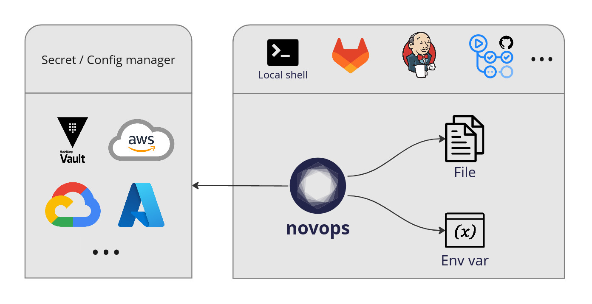

# Novops

Platform agnostic secret and config manager for DevOps, CI and development environments.

- [Novops](#novops)
  - [Features](#features)
    - [Modules: Hashicorp Vault, AWS, GCloud, Azure...](#modules-hashicorp-vault-aws-gcloud-azure)
  - [Install](#install)
  - [Getting started](#getting-started)
  - [Documentation](#documentation)
  - [Contributing](#contributing)

## Features



- Securely load secrets and configs as files or environment variables
- Reduce drift between local dev context and CI/CD
- Integrate with various secret providers: Hashicorp Vault, AWS GCloud, Azure...
- Easily integrated within most shells and CI systems: Gitlab, GitHub, Jenkins...
- Manage multi-environment (dev, preprod, prod...)
- Quick and easy installation using static binary

### Modules: Hashicorp Vault, AWS, GCloud, Azure...

[See all available modules](docs/modules.md)

## Install

```
curl -L "https://github.com/novadiscovery/novops/releases/latest/download/x86_64-unknown-linux-musl.zip" -o novops.zip
unzip novops.zip
sudo mv novops /usr/local/bin/novops
```

## Getting started

Create a `.novops.yml` file:

```yaml
name: myapp

# Dictionary of environments user can choose from when running novops
# Keys are environment name
# Each environment defines inputs loaded as either files or variables
environments:

  # Dev environment definition
  dev:

    # List of variables to load for dev
    variables:

      # Plain string
      - name: APP_URL
        value: "http://127.0.0.1:8080"

      # Use Hashicorp Vault KV2 module to set variable value
      # `value` specify the module config, i.e. the reference to value we want to retrieve
      - name: APP_PASSWORD
        value:
          hvault_kv2:
            path: crafteo/app/dev
            key: password

      # Any module loading string value can be used with variable
      # See docs/modules.md for a list of all modules
      # And examples/ for full examples per modules
      # - name: ANOTHER_SECRET
      #   value:
      #     module_name:
      #       some_config: foo
      #       aother_config: bar

    # List of files to load for dev
    # Modules and plain string can be specified as file content
    files: 

      # Retrieve AWS Secrets Manager secret
      # File path will be exposed via env var APP_TOKEN
      # APP_TOKEN variable will point to file containing secret
      # Such as APP_TOKEN='/run/user/1000/novops/myapp/dev/file_APP_TOKEN'
      - variable: APP_TOKEN
        content:
          aws_secret:
            id: my-app-dev-token
```

Novops will generate a **secure** sourceable file containing all your variables and references to files such as:

```sh
$ cat /run/user/1000/novops/example-app/local/vars
# export APP_URL='127.0.0.1:8080'
# export APP_PASSWORD='s3cret'
# export APP_TOKEN='/run/user/1000/novops/myapp/dev/file_APP_TOKEN'

$ cat $APP_TOKEN
# TheSecretToken
```

Load config:
- **We strongly recommend using [`direnv`](https://direnv.net/)** for seamless shell integration
  ```sh
  # Load novops and create a symlink .envrc -> secure sourceable file
  # direnv will source automatically in current shell
  novops load -e dev -s .envrc
  # ...
  # direnv: loading ~/myproject/.envrc  
  ```
  See [Why is Novops + direnv strongly advised?](./docs/novops-direnv.md)
- Alternatively you can source manually:
  ```sh
  novops load -e dev -s .myenvs && source .myenvs
  ```

Your shell session is now loaded!

```sh
env | grep APP_
# APP_URL=127.0.0.1:8080
# APP_PASSWORD=s3cret
# APP_TOKEN=/run/user/1000/novops/myapp/dev/file_APP_TOKEN
```

## Documentation

- [Security - how safe is Novops?](./docs/security.md)
- [Why is Novops + direnv strongly advised?](./docs/novops-direnv.md)
- [Usage with DevOps tools: Docker, GitLab CI, Nix...](./docs/usage.md)
- [All modules: Hashicorp Vault, AWS, GCloud, Azure...](./docs/modules.md)
- [`.novops.yml` configuration reference](./docs/schema.json)
- [Internal architecture: Inputs, Outputs and resolving](./docs/architecture.md)
- [Development guide](./docs/development.md)

## Contributing

We welcome contributions: bug reports/fixes, modules, proposals... :)

See [contribution guide](./CONTRIBUTING.md)
