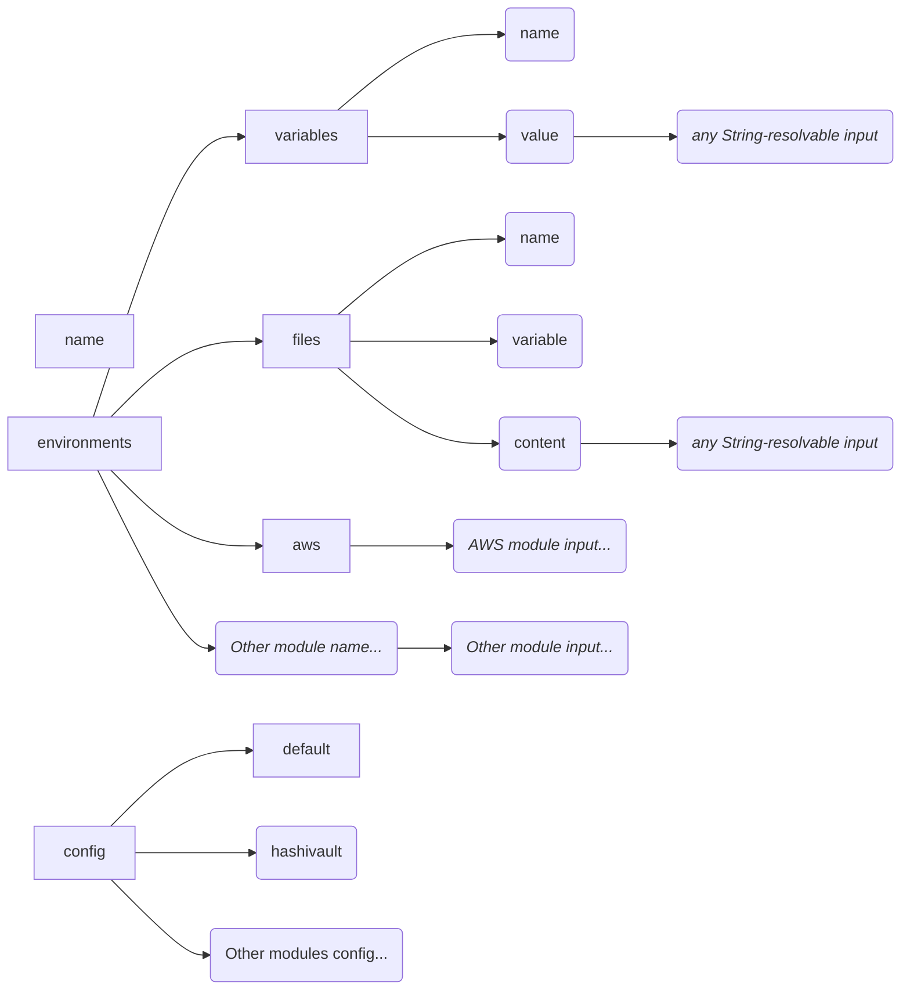

# Internal architecture: Inputs, Outputs and resolving

- [Modules, Inputs, resolving & Outputs](#modules-inputs-resolving--outputs)
- [Novops config schema and internal structure](#novops-config-schema-and-internal-structure)

Novops relies around the following concepts:

## Modules, Inputs, resolving & Outputs 

_Inputs_ are set in `.novops.yml` to describe how to load value. They usually reference an external secret/config provider or a clear-text value.

_Modules_ are responsible for generating outputs from inputs by resolving them. For example, `hvault_kv2` module load secrets from Hashicorp Vault KV2 engine:

```yaml
# hvault_k2 input: reference secrets to load
hvault_kv2:
  path: myapp/creds
  key: password
```

_Outputs_ are objects based obtained from Inputs when they are _resolved_. Currently only 2 types of Output exists:
- Files
- Environment variables (as a sourceable file)

`hvault_kv2` example would output a `String` value such as

```
myPassw0rd
```

Inputs can be combined with one-another, for example this `.novops.yml` config is a combination of Inputs:

```yaml
environments:
  # Each environment is a complex Input
  # Providing both Files and Variable outputs
  dev:

    # variables is itself an Inputs containing a list of others Inputs
    # Each Variables Inputs MUST resolve to a String
    variables:
      
      # variable input and it's value
      # It can be a plain string or any Input resolving to a string
      - name: APP_PASS
        value:
          hvault_kv2:
            path: myapp/creds
            key: password
      
      - name: APP_HOST
        value: localhost:8080

    # files is an Inputs containing a list of other Inputs
    # Each file input within resolve to two outputs:
    # - A file output: content and path 
    # - A variable output: path to generated file
    files:
      - name: APP_TOKEN
        # Content takes an Input which must resolve to a string or binary content
        content:
          hvault_kv2:
            path: myapp/creds
            key: api_token
```

When running, `novops load` will:

1. Read config file and parse all Inputs
2. Resolve all Inputs to their concrete values (i.e. generate Outputs from Inputs)
3. Export all Outputs to system (i.e. write file and provide environment variable values)

Resolving mechanism is based on `ResolveTo` trait implemented for each Input. An example implementation for `HashiVaultKeyValueV2` into a `String` can be:

```rust
// Example dummy implementation resolving HashiVaultKeyValueV2 as a String
impl ResolveTo<String> for HashiVaultKeyValueV2 {
    async fn resolve(&self, _: &NovopsContext) -> Result<String, anyhow::Error> {
      let vault_client = build_vault_client(ctx);
      
      return Ok(
        vault_client.kv2.read(&self.mount, &self.path, &self.key).unwrap().to_string()
      )
    }
}
```

See [`src/core.rs`](https://github.com/PierreBeucher/novops/blob/main/src/core.rs) for details.

## Novops config schema and internal structure

Novops config is generated directly from internal Rust structure of Inputs deriving `JsonSchema` from the root `struct core::NovopsConfigFile`

For instance:

```rust
#[derive(/* ... */ JsonSchema)]
pub struct NovopsConfigFile {
    pub environments: HashMap<String, NovopsEnvironmentInput>,
    pub config: Option<NovopsConfig>
}
```

Define top-level Novops config schema:

```yaml
environments:
  dev: # ...
  prod: # ...
    
config: # ...
```

Top level structure of config (leaf are plain values):

