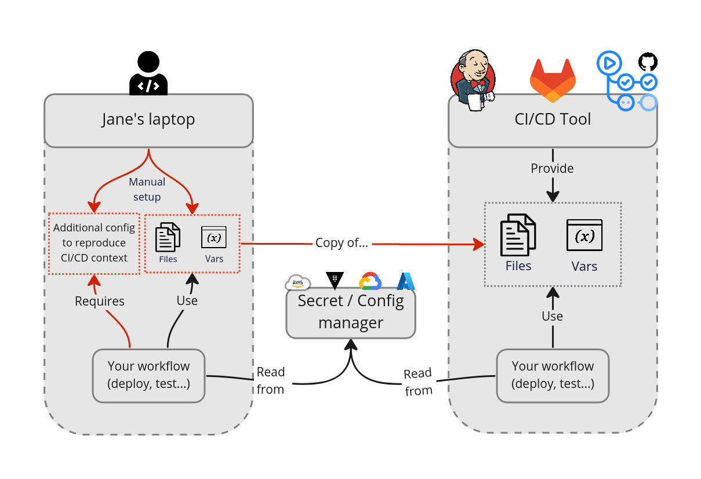

# Why Novops ?

Secrets are often mishandled in development environments, production procedure and CI pipelines:

- Kept locally under git-ignored directories and forgotten about
- Kept under unsafe directories (world or group readable)
- Accessible directly or indirectly by way too much people in your CI server config

They're also hard to manager, developers ending-up with poor experience when they need to configure their projects for multi-environment workload:

- Hours are spent by your team hand-picking secrets from secret manager and switching between dev/prod and other environment configs
- You're not able to reproduce locally what happens on CI as per all the variables and secrets configured, spending hours debugging CI problems
- Even with Docker, Nix, GitPod or other tools providing a reproducible environment, you still have significant drift because of environment variables and config files
- Your developers want to access Production and sensible environments but they're locked out as per lack of possibility to provide scoped, temporary and secure credentials

## With and without Novops

Consider a typical Infra as Code project:
- Deployment tool such as Terraform, Ansible or Pulumi
- CI/CD with GitLab CI, GitHub Action or Jenkins
- Multiple environments (dev, prod...)

Secrets are managed by either:
- A secret / config manager like Hashicorp Vault or AWS Secret Manager
- Vendor-specific CI/CD secret storage provided as environment variables or files
- Secrets stored locally on developer machines, often synced manually from one of the above

Novops allow your team to manage secrets & configs from a single Git-versioned file. Reproducing CI/CD context locally becomes easier and more secure:
- Files and environment variables are loaded from the same source of truth
- Secrets are stored securely and can be cleaned-up easily
- It's then easy to reproduce the same context locally and on CI/CD

